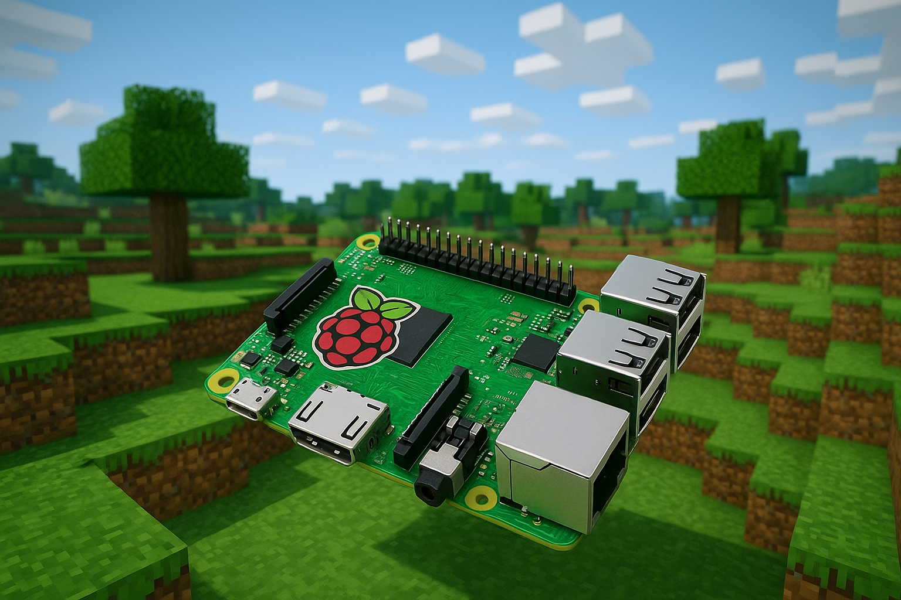

# RaspberryPi 4 Poky-based distribution with embedded Minecraft server

## How to run
1. Install docker with this instructions https://docs.docker.com/engine/install/ubuntu/ (In case of buildix issue: https://forums.docker.com/t/tips-for-how-to-fix-my-borked-cli-plugins/144327/3)
2. Clone this repository
3. cd RaspberryPi4-PokyWithMinecraftServer
3. run ./dockerize.sh
4. run ./build.sh
5. run ./extract_image.sh
6. System image will be copied to your current working directory, you can now upload it to your Pi using dd or Raspberry Pi Imager.

## Minecraft server
After the Pi boots with the new image, Minecraft server will be started as a systemd service called minecraft-server. A new world will be
automatically created. You can join it by opening Minecraft, going to "Multiplayer", clicking "Add server" and then add entering <raspberry_pi_local_ip>:25565 in "Server Address" field. "Server Name" can be chosen to you liking.